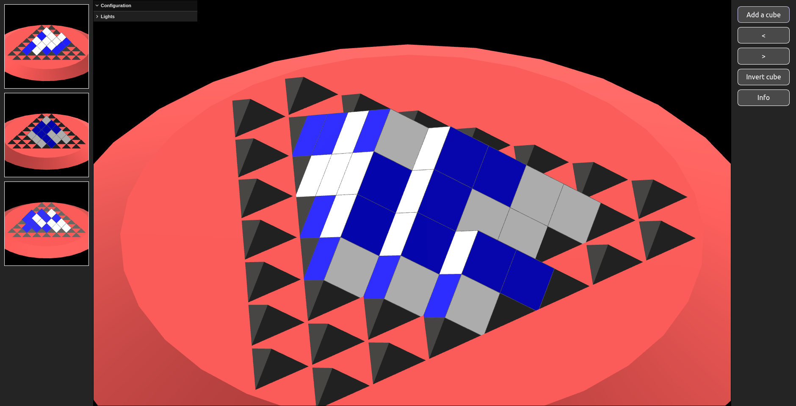

# Cubus

A friend of mine showed me a game this week in which players stack cubes to
connect 4 faces of their color in a row--on any of the three visible sides of the block. This
game design presented lots of interesting challenges and problems that I
discovered as I played. In order to play some more, I built a 3-D simulation of
the game in the browser.
